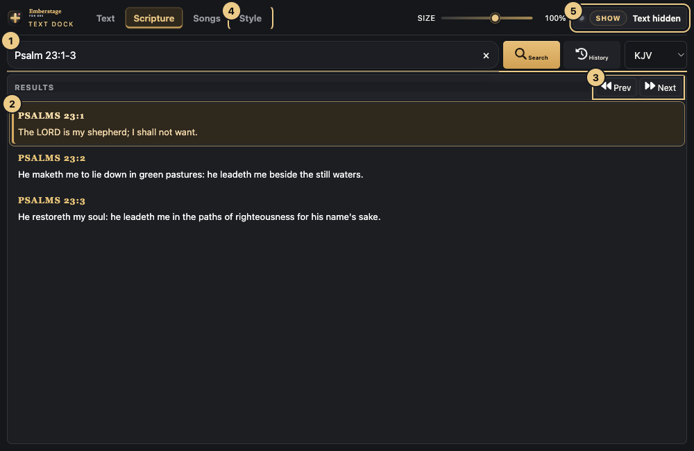
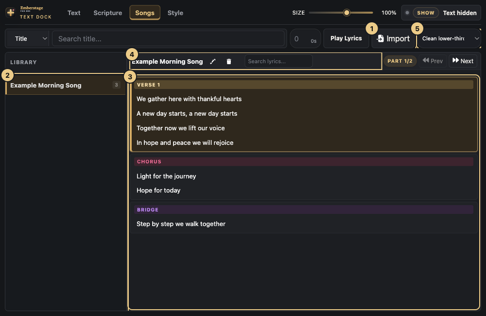
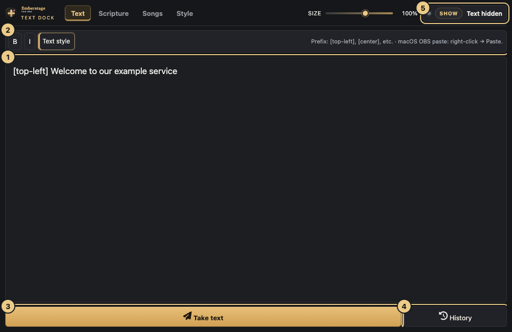
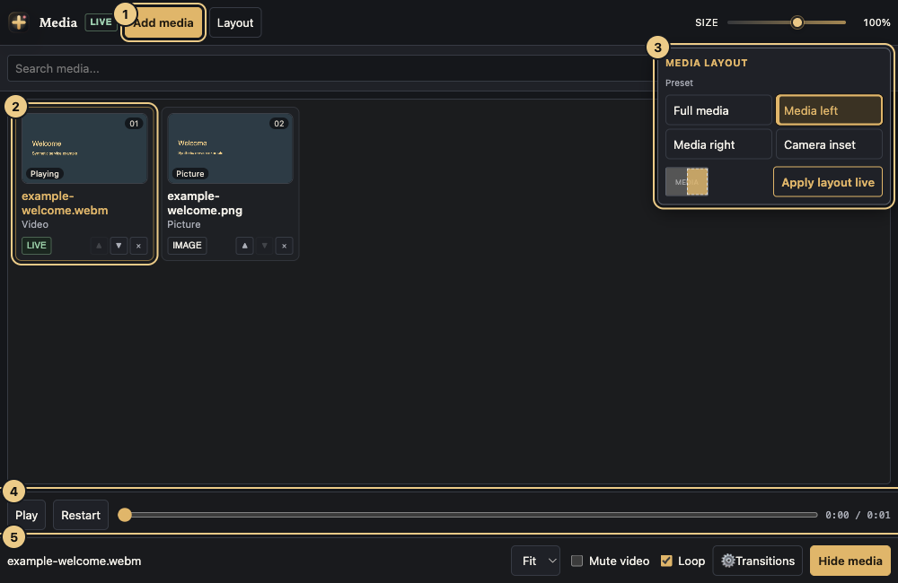
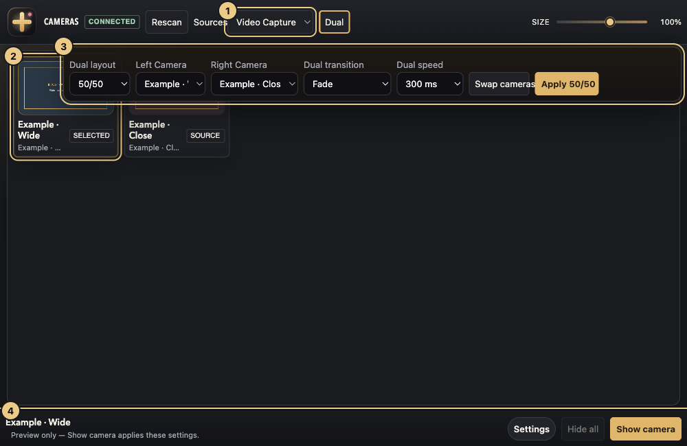
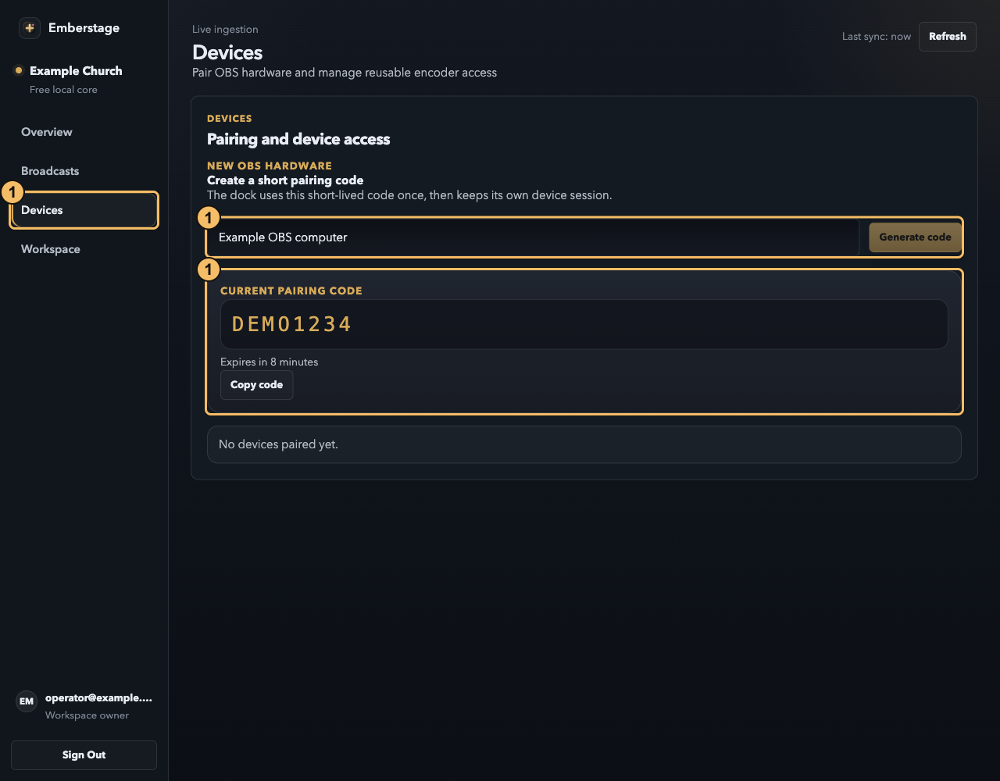
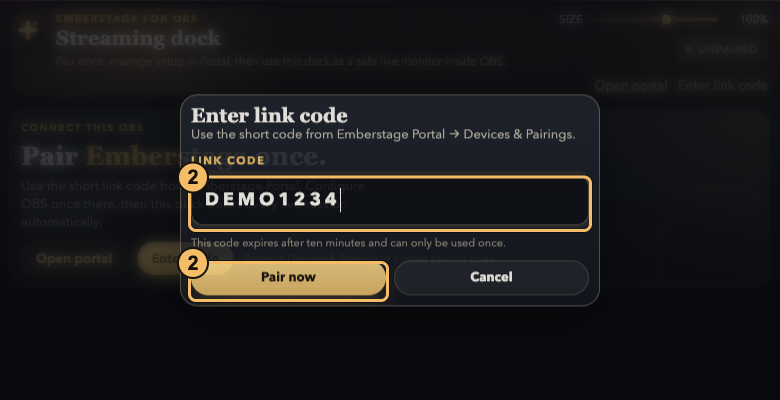
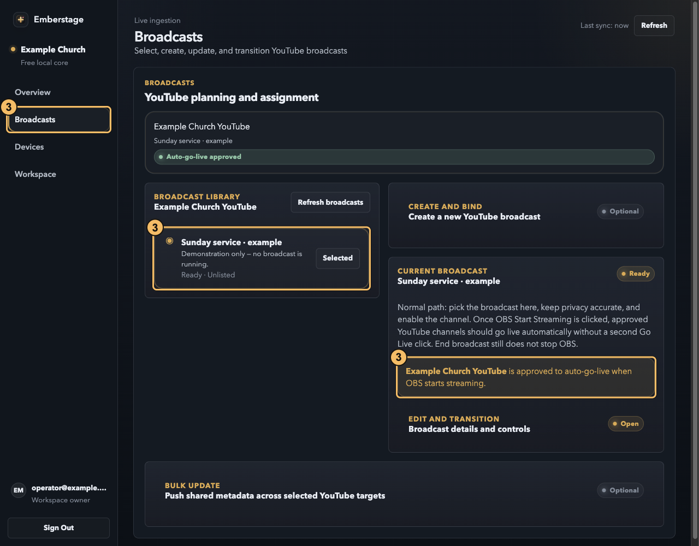
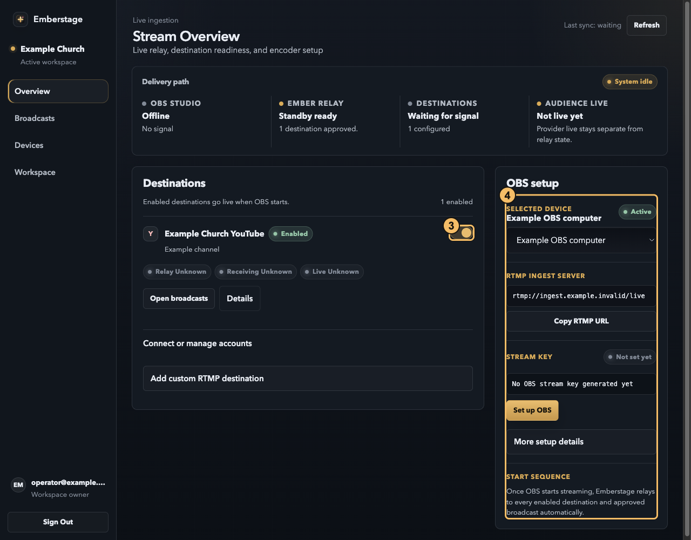
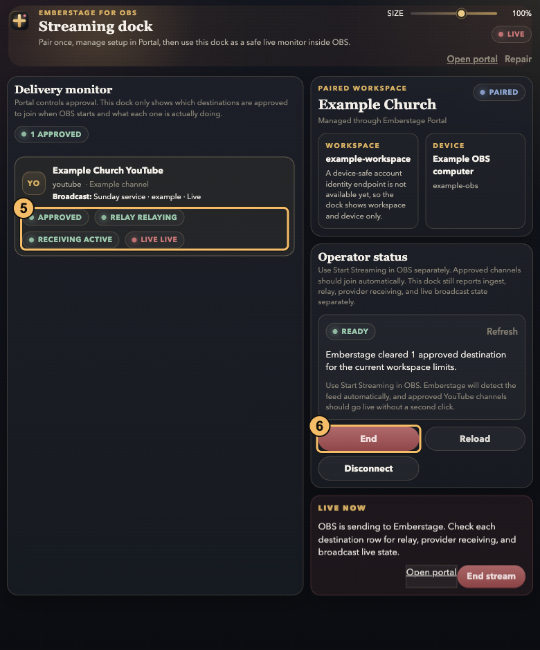

<p align="center">
  <a href="https://emberstage.pages.dev/">
    
  </a>
</p>
<p align="center">
  
</p>

# Emberstage for OBS · Comprehensive Operator & Installer Guide

Emberstage puts Scripture, songs, text, videos, pictures, and native camera controls inside OBS Studio. The local tools work without a product account. Managed streaming is a separate, server-configured service; OBS remains your compositor and encoder.

**[Illustrated website guide](https://emberstage.pages.dev/#operator-guide)** · **[GitHub](https://github.com/Rotimiiam/emberstage)** · **[Installer builds](https://github.com/Rotimiiam/emberstage/actions/workflows/installers.yml)** · **[Releases](https://github.com/Rotimiiam/emberstage/releases)**

> **Preview software:** installers are unsigned. Rehearse with your own OBS configuration and hardware before a live service. This repository does not include streaming-provider credentials, a hosted relay, or a paid-service subscription.

---

## Table of Contents
- [Table of Contents](#table-of-contents)
- [System Architecture \& Philosophy](#system-architecture--philosophy)
- [Platform Installation Guides](#platform-installation-guides)
  - [Prerequisites](#prerequisites)
  - [Important Unsigned Release Notices](#important-unsigned-release-notices)
  - [GitHub Actions Installers \& Preview Releases](#github-actions-installers--preview-releases)
  - [Windows Installation (Standard & PowerShell)](#windows-installation-standard--powershell)
  - [macOS Installation (Disk Image & Terminal)](#macos-installation-disk-image--terminal)
  - [Linux Installation (Flatpak & Native)](#linux-installation-flatpak--native)
  - [Local OBS WebSocket Integration](#local-obs-websocket-integration)
  - [Backup, Upgrade, \& Rollback Safety](#backup-upgrade--rollback-safety)
- [The 7-Section Operator Guide \& Workflows](#the-7-section-operator-guide--workflows)
  - [01. Get Oriented (Philosophy of Controls)](#01-get-oriented-philosophy-of-controls)
  - [02. Scripture (Reference Searching \& Styling)](#02-scripture-reference-searching--styling)
  - [03. Songs \& Lyrics (Cues \& Repetitions)](#03-songs--lyrics-cues--repetitions)
  - [04. Text (Quick Announcements \& Overlays)](#04-text-quick-announcements--overlays)
  - [05. Media (Stills, Videos, and Dual Layouts)](#05-media-stills-videos-and-dual-layouts)
  - [06. Cameras (Native OBS Mapping)](#06-cameras-native-obs-mapping)
  - [07. Managed Streaming (Multi-Destination Relay)](#07-managed-streaming-multi-destination-relay)
- [Detailed Feature Deep-Dives](#detailed-feature-deep-dives)
  - [Intelligent Automatic Chorus Repetition](#intelligent-automatic-chorus-repetition)
  - [New "Half Screen (Full Verse)" Layout](#new-half-screen-full-verse-layout)
- [Pricing Plans \& Provider Gating](#pricing-plans--provider-gating)
  - [Pricing Structure](#pricing-structure)
  - [Streaming Provider Status](#streaming-provider-status)
- [Troubleshooting, Security, \& Safety](#troubleshooting-security--safety)
- [Local Developer Setup \& Tests](#local-developer-setup--tests)
- [License, Translations, \& Attribution](#license-translations--attribution)

---

## System Architecture & Philosophy

1. **Docks are controls, not output:** typing a text draft, searching Scripture, and selecting a media/camera card do not show them on Program.
2. **Know the live actions:** clicking a verse or lyric cue can show it immediately. Loading a song or advancing lyrics can replace text already on screen. Hide shared text first when preparing songs privately. Media/camera selection requires **Show**; text drafts require **Take text**.
3. **No Special Browser Flags:** Ordinary OBS is launched natively. It directly manages hardware and video encoders. Older configurations requiring custom browser arguments (`--enable-media-stream`) or special launchers are completely avoided.
4. **WebSocket Control Bridge:** Cameras, layouts, and system transitions communicate directly with OBS via an authenticated localhost OBS WebSocket connection.
5. **Separate control plane:** local presentation does not require cloud pairing. Managed streaming and external destinations still need working network and server connections.

---

## Platform Installation Guides

**Start at [GitHub Releases](https://github.com/Rotimiiam/emberstage/releases).** Open the newest published release (including pre-releases during the preview), expand **Assets**, and download the installer for your computer plus its matching `.sha256` checksum:

| Platform | Download from release Assets |
| --- | --- |
| Windows | `Emberstage-Setup.exe` |
| macOS | `Emberstage-macOS.dmg` |
| Linux | `Emberstage-Linux.tar.gz` |

Choose these named installers, **not** GitHub's automatically generated **Source code (zip/tar.gz)** links. Public release downloads do not require GitHub sign-in. Then follow your platform instructions below with OBS fully closed.

The setup scripts configure an existing OBS installation. They copy all application assets to a stable, isolated user directory. Moving or deleting the repository checkout after installation will **not** break your OBS docks, scripts, or sources.

### Prerequisites
- **OBS Studio 31+** (Mandatory for UUID-based WebSocket requests and native scene collections).
- **Python 3** (Mandatory for macOS and Linux installer execution).
- **Windows 10/11 x64** and Windows PowerShell 5.1+ for the Windows installer.
- An OBS build with Browser Source and Custom Browser Docks support. Open OBS once, select/create your scene collection, then fully quit it before installation.
- For source installation, download and extract [the source ZIP](https://github.com/Rotimiiam/emberstage/archive/refs/heads/main.zip), or run `git clone https://github.com/Rotimiiam/emberstage.git`. Run the commands below from the extracted repository root.

### Important Unsigned Release Notices
Because the installer scripts, binaries, and wizards are unsigned:
- **Windows:** SmartScreen may warn about an unknown publisher. Verify the download and checksum; approve only that file if you trust it and your policy permits. PowerShell execution policy is separate from SmartScreen; the commands below use a process-only bypass, not a permanent policy change.
- **macOS:** the DMG is not notarized. If macOS blocks the command, use the per-file Open option or **System Settings → Privacy & Security** approval only if you trust it. Do not disable Gatekeeper globally.

### GitHub Actions Installers & Preview Releases
The [Installers workflow](.github/workflows/installers.yml) builds:
- **Windows:** `Emberstage-Setup.exe` (Packaged via Inno Setup wizard)
- **macOS:** `Emberstage-macOS.dmg` (Packaged via `hdiutil` payload DMG)
- **Linux:** `Emberstage-Linux.tar.gz` (Host-side installer archive)

**For normal installation, use [GitHub Releases](https://github.com/Rotimiiam/emberstage/releases), not Actions artifacts.** The workflow runs checks and builds on pushes to **main**, `v*` tags, or **Actions → Installers → Run workflow**. Pull requests run Linux checks only. Tagged builds create a **draft prerelease** for maintainer review before publication. Developers testing unreleased builds can download a successful run's artifact (GitHub sign-in required) and extract its ZIP; these temporary artifacts expire after 14 days.

All jobs use standard GitHub-hosted runners, not personal/production self-hosted runners. No cloud deployment secrets or signing credentials are required. CI verifies code, payloads, and isolated installer fixtures; it does not certify camera hardware or OBS GUI rendering.

### Windows Installation (Standard & PowerShell)

Windows installations resolve to a stable application directory at `%LOCALAPPDATA%\Emberstage\app`.

**Recommended:** go to [GitHub Releases](https://github.com/Rotimiiam/emberstage/releases), download **Emberstage-Setup.exe** from **Assets**, and run it with OBS closed. Follow the wizard and retain the printed backup path. The PowerShell commands below are an alternative for source installations.

#### PowerShell Installer (Dry-run preview):
```powershell
powershell.exe -NoProfile -ExecutionPolicy Bypass -File .\scripts\install-media-deck.ps1
```

#### PowerShell Installer (Apply changes):
Ensure OBS is completely closed first, then run:
```powershell
powershell.exe -NoProfile -ExecutionPolicy Bypass -File .\scripts\install-media-deck.ps1 -Apply
```

If using a custom or portable OBS config directory containing `user.ini`, supply it explicitly:
```powershell
powershell.exe -NoProfile -ExecutionPolicy Bypass -File .\scripts\install-media-deck.ps1 -ObsConfigPath "D:\OBS test config" -Apply
```

#### Windows Inno Setup Wizard:
Download **Emberstage-Setup.exe** directly from [GitHub Releases → Assets](https://github.com/Rotimiiam/emberstage/releases), then run it with OBS closed. Follow the wizard, retain the printed backup path, and launch OBS normally afterward.

To build the standard user-installable wizard (`dist/Emberstage-Setup.exe`) on a machine with Inno Setup installed, run from the repository root:
```powershell
ISCC.exe scripts\windows\emberstage.iss
```
This compiled setup executable installs per-user without requiring local Administrator rights. It automatically prevents installation while OBS is running and provides native Repair and Uninstall entries.

---

### macOS Installation (Disk Image & Terminal)

macOS installations resolve to a stable application directory at `~/Library/Application Support/Emberstage`.

1. Download **Emberstage-macOS.dmg** from [GitHub Releases → Assets](https://github.com/Rotimiiam/emberstage/releases), ensure Python 3 is installed, and fully close OBS Studio.
2. Open `Emberstage-macOS.dmg`, then double-click `Install Emberstage.command` beside its `payload` folder. This launches a Terminal session.
3. Review the printed dry-run modifications.
4. Type `yes` and press `<Enter>` to write. Any other response cancels safely.
5. Launch OBS and arrange the new custom docks manually.

Alternatively, from a complete source checkout:
```bash
bash scripts/install-media-deck.sh          # preview only
bash scripts/install-media-deck.sh --apply  # with OBS fully closed
```

#### Packager script:
To rebuild the read-only, compressed macOS DMG archive (`dist/Emberstage-macOS.dmg`) from a macOS source checkout:
```bash
python3 scripts/package-macos.py
python3 tests/package-macos-contract.py
```

---

### Linux Installation (Flatpak & Native)

Download **Emberstage-Linux.tar.gz** from [GitHub Releases → Assets](https://github.com/Rotimiiam/emberstage/releases), extract it, and open a terminal in its `Emberstage` folder (or use a complete source checkout). Linux supports both Flatpak and native OBS:
- Flatpak assets write directly into the OBS-owned workspace: `~/.var/app/com.obsproject.Studio/data/Emberstage`.
- Native assets write to `$XDG_DATA_HOME/Emberstage` (default: `~/.local/share/Emberstage`).

To configure Flatpak OBS (no host filesystem exposure requested or sandbox weakened):
```sh
# Dry-run review:
sh scripts/linux/install-emberstage.sh --flatpak

# Apply:
sh scripts/linux/install-emberstage.sh --flatpak --apply
```

To configure native Linux OBS (respects `$XDG_CONFIG_HOME` and `$XDG_DATA_HOME`):
```sh
# Dry-run review:
sh scripts/linux/install-emberstage.sh --native

# Apply:
sh scripts/linux/install-emberstage.sh --native --apply
```

---

### Local OBS WebSocket Integration

**Apply enables authenticated OBS WebSocket automatically** in `plugin_config/obs-websocket/config.json`. It preserves a valid existing port and nonempty password, or securely generates a password. Dry-run does not write these changes. The legacy `--enable-websocket` / `-EnableWebSocket` switches remain accepted but are not required.

Credentials are stored locally in OBS configuration and a user-only `Emberstage-private/obs-connection.js` file outside the public app assets. The installer-generated `native-install.js` points to that private file and records scene identities; it is not the repository's placeholder. **Do not overwrite it when copying updates manually, or share private files/backups.**

The dock connects to the local OBS service. The installer does **not** change firewall rules or guarantee a loopback-only listener. Keep the service private using your network/firewall settings. No stream is started, and no OBS process is stopped or restarted by installation.

---

### Backup, Upgrade, & Rollback Safety

Before writing changes, Apply creates a timestamped backup (`media-deck-backup-<timestamp>`) beside the selected OBS config directory. An unchanged installation is a no-op. Existing profiles, stream settings, unrelated docks, media libraries, and scene visibility are preserved. File-by-file rollback handles ordinary failures; power loss or forced termination can still require manual recovery.

#### What is backed up:
- Original bytes of affected configs (`user.ini`, the selected scene collection, and WebSocket configuration).
- An exact state manifest file (`manifest.json`).
- The entire previous stable app payload, saved inside `previous-app`.

#### Standard Rollback Procedure:
1. Close all OBS instances completely.
2. Locate the backup folder paths printed by the installer script.
3. Open `manifest.json`.
4. Restore every file marked with `"existed": true` by copying it back to the active OBS config directory.
5. Remove any file marked with `"existed": false` to clean up new additions.
6. On upgrade, restore `previous-app` to the installed app location. For a first install, remove only the new app-owned installation after restoring configuration. Preserve operator-added files and browser data. Follow the printed manifest/rollback instructions; do not replace or delete the entire OBS config tree.

**First launch:** arrange **Em - Text**, **Em - Media**, **Em - Cameras**, and **Em - Streaming**. The installer adds a hidden nested **Emberstage Program** scene containing **Emberstage Camera A**, **Emberstage Camera B**, and **Emberstage Graphics**. Enable its eye icon in your intended OBS scene when ready, keep the graphics layer on top, and verify it on Program. No extra legacy Browser Source is needed. Keep old output sources for rollback, but manually hide duplicates during rehearsal to avoid double rendering. Use ordinary OBS launch—not the legacy camera-mode shortcuts.

---

## The 7-Section Operator Guide & Workflows

### 01. Get Oriented (Philosophy of Controls)
The docks represent your control center; OBS Program represents your air output. In Studio Mode, keep a close eye on the differences between preview modifications and the program output.
- **Dock Focus:** Preparing an announcement, searching lyrics, or cueing a camera is done privately inside the docks.
- **Top Show/Hide Toggle:** Controls the shared text rendering layer (Text, Scripture, and Songs).
- **Layout Independent Controls:** Media files and camera feeds are composite assets managed separately from text overlays.
- A dock's LIVE state does not prove that its source is visible on OBS Program. Rehearse one cue, verify it there, then hide it. **Size** scales dock controls, not output text.
- Screenshots below are locally rendered example UI: sample names, lyrics, pairing codes, media, and live indicators. Camera thumbnails are illustrative; no real hardware, credentials, or broadcast was used. Amber numbers correspond to captions.

### 02. Scripture (Reference Searching & Styling)
Find your verses swiftly and customize exactly how they are rendered on screen.
1. **Search:** Select your Bible translation, and type in a passage reference (e.g., `Psalm 23:1-3`), chapter, or a keyword. Press `<Enter>` or click **Search**.
2. **Cue Selection:** The initial `<Enter>` focuses the first result card privately without putting it on air. Click a verse card or press `<Enter>` a second time to push it live. Clicking an already-live verse hides it immediately.
3. **Navigate:** Press `<Left>` / `<Right>` or use **Prev** / **Next** to focus nearby verses without publishing them.
4. **Broadcast styling:** Navigate to **Style → Scripture broadcast look**, select either *Lower third scripture* or *Full-screen scripture card*, customize colors/logos, and click **Apply broadcast look**.
5. **Restore or hide:** **Restore legacy** returns the previous rendering style. The top **Show/Hide** toggle clears/reveals shared text without hiding media or cameras. Keep keyboard focus out of the search box for verse navigation.

Shorthand covers all 66 books, including `Phi` → Philippians, `Mal` → Malachi, `1 the` → 1 Thessalonians, and `Phm` → Philemon. Dotted abbreviations, joined references, and ordinal/Roman numbering are supported. Clicking into the search box initially selects the query for replacement; Up from the first search result returns focus to it.

<p align="center">
  
</p>
<p align="center">
  <em><strong>Figure 1:</strong> 1 - Search Input · 2 - Active Verse Cue · 3 - Target Navigation Controls · 4 - Styling Options · 5 - Global Text Visibility Toggle.</em>
</p>

---

### 03. Songs & Lyrics (Cues & Repetitions)
Easily import lyric collections and run seamless presentations.
1. **Import:** Click **Import** to upload one or multiple plain `.txt` song files. Add a `Title:` metadata line to name the song, and separate sections with headings like `[Verse 1]` or `[Chorus]`.
2. **Retrieve:** Search the Library by **Title**, or choose **Lyrics** to search across the local library. Loading a song sends its opening cue and can replace visible text: hide shared text first to prepare privately. **Search lyrics…** searches only the loaded song.
3. **Present:** Click sections or individual lines to show lyrics; repeating the live cue hides it. Use `<Up>` / `<Down>` or **Prev** / **Next** to advance output, not just selection. If hidden, click a cue or **Show** to reveal it. Compact looks split longer sections into two-line **PART** cues; line-by-line mode stays single-line.
4. **Looks:** Choose from *Full screen*, *Clean lower-third*, *Soft gradient strip*, *Compact lyric card*, *Half screen*, or *Side panel*. Enable automatic pagination timers via **Play Lyrics** if required.
5. **Manage:** Pencil → **Edit Song** → **Save** edits title/lyrics. Trash opens a confirmation before **Delete**. These affect the local library, not original files or already displayed output. For automatic advancement, set positive seconds and choose **Play Lyrics**; **Stop** stops the timer, not the text output.

<p align="center">
  
</p>
<p align="center">
  <em><strong>Figure 2:</strong> 1 - Import File Upload · 2 - Local Song Library Panel · 3 - Section & Lyric Cue list · 4 - Song Editor & Searching · 5 - Lyric Layout drop-down.</em>
</p>

---

### 04. Text (Quick Announcements & Overlays)
Generate fast, clear overlays for announcements or emergency notifications.
1. **Compose:** Open **Text**, write a message, and format it using Bold (**B**) and Italic (***I***) markup.
2. **Positioning Prefixes:** Use bracketed prefixes to change positions, such as `[top-left] Welcome` or `[center] Prayer is starting`.
3. **Take:** Click **Take text** to project the draft live. Re-submitting an active message hides it.
4. **Style:** Open **Text style** inside the Text tab: Legacy, Lower third, or Full-screen card, optional church name/logo, entrance/exit settings. **Apply broadcast look** applies; **Done** closes; **Restore legacy** resets. Text styling is independent of Scripture styling.
5. **History and hide:** **History** loads sent-message history into the editor; edit and take when ready. The top **Show/Hide** clears the shared Text/Scripture/Songs layer without erasing the draft or hiding media/cameras.

<p align="center">
  
</p>
<p align="center">
  <em><strong>Figure 3:</strong> 1 - Text Editor & Position Prefixes · 2 - Style Customizations · 3 - Take Text Publishing · 4 - Message History · 5 - Global Text Visibility.</em>
</p>

---

### 05. Media (Stills, Videos, and Dual Layouts)
Manage your videos and backgrounds right within OBS.
1. **Load:** Click **Add media** to load JPEG, PNG, GIF, WebP, MP4, or WebM media files.
2. **Play:** Click cards to preview them, and use **Show media** to project them on air. Click **Play/Pause**, **Restart**, or drag the seek-bar to control videos. Toggle **Mute video** and **Loop** as needed.
3. **Sizing:** Use **Fit** to preserve aspect ratios, or **Fill** to cover the active video canvas.
4. **Layout:** Arrange media side-by-side with camera inputs by choosing *Full media*, *Media left*, *Media right*, or *Camera inset*. Apply layouts to live media using **Apply layout live**.
5. **Hide:** the live item changes to **Hide media**. Show a camera from Cameras before choosing a shared layout; the layout does not start one for you. Choose the inset corner where offered. Full media covers the underlying camera composition; hiding it reveals that composition again. Fill may crop edges; Fit keeps the whole item visible.

<p align="center">
  
</p>
<p align="center">
  <em><strong>Figure 4:</strong> 1 - Add Media Portal · 2 - Active Selection · 3 - Camera Layout Presets · 4 - Video Timeline & Seek controls · 5 - Media playback toggles.</em>
</p>

---

### 06. Cameras (Native OBS Mapping)
Map physical cameras directly through an authenticated WebSocket connection.
1. **Map Sources:** Set up your inputs as ordinary **Video Capture Device** sources in OBS, then click **Rescan** inside the dock.
2. **Show Camera:** select a camera, then **Settings → Framing** (Fit/Fill), Transition and Speed, then **Show camera**. It fills the frame unless media shares it. Selection/framing changes alone do not apply; the same live single camera offers **Hide camera**. **Video Capture** filters ordinary cameras; **All sources** exposes other OBS inputs. No browser camera permission is needed.
3. **Dual Cameras:** open the top-bar **Dual** popup and assign two different cameras. Choose *50/50* or *Big + small*, corner, transition, and speed. **Swap cameras** reverses assignments; **Apply 50/50** or **Apply big + small** takes the layout live.
4. **Unapply or hide:** when settings match the active dual view, Apply becomes **Unapply**. Changed settings must be applied first. Unapply restores the previous single camera (or left/big camera if none was saved), not a blank output. If the saved camera is unavailable, the dual view remains active with a notice. **Hide all** clears Emberstage cameras. These actions do not switch the OBS Program scene or control unrelated source visibility.

<p align="center">
  
</p>
<p align="center">
  <em><strong>Figure 5:</strong> 1 - Device filters · 2 - Selected input · 3 - Dual arrangement selection · 4 - Device settings & visibility.</em>
</p>

---

### 07. Managed Streaming (Multi-Destination Relay)
Manage multi-destination live streams securely using a paired cloud workspace.

Only use this with a configured managed-streaming server. Local tools need neither pairing nor a cloud login.

1. **Open portal / create a code:** in Streaming choose **Open portal**, sign into the correct workspace, then **Devices → Pairing and device access**. Name the OBS computer and **Generate code**. Already correctly paired? Skip to step 3.
2. **Pair the dock:** **Streaming → Enter code → Pair now**. Codes expire in ten minutes and work once. Check the paired workspace and device.
3. **Approve destinations:** **Portal → Overview → Destinations** connects eligible accounts or custom RTMP. For YouTube open **Broadcasts**, choose the channel, then **Use this** on an existing broadcast or **Create and bind broadcast**. Check privacy. Return to Destinations and enable only intended channels: choosing a broadcast does not approve its channel.
4. **Configure OBS once:** after pairing, **Overview → OBS setup**, select the active device, then **Set up OBS** if it has no key. Paste that device's ingest server/key into **OBS Settings → Stream → Custom**. Keep the key private; do not rotate a working key just to follow this guide.
5. **Start and monitor:** check readiness, then **Start Streaming in OBS**. Approved YouTube channels should go live automatically without another Go Live click. Watch relay, receiving, and live status separately—a working relay alone is not proof viewers are live.
6. **End deliberately:** use dock **End** to end the managed session, and **OBS Stop Streaming** to stop the encoder. Neither dock End nor portal YouTube **End broadcast** stops OBS. Verify both the destinations and encoder have stopped.

Before starting: correct workspace/device, only intended destinations approved, correct broadcast/privacy, current ingest/key, and readiness checked. Screenshots show example codes and nonfunctional ingest values; copy your own server's values, never these examples.

<p align="center">
  <table border="0" cellspacing="10" cellpadding="0" align="center">
    <tr>
      <td align="center">
        <br />
        <em><strong>Figure 6:</strong> Step 1 - Generate device pairing codes.</em>
      </td>
      <td align="center">
        <br />
        <em><strong>Figure 7:</strong> Step 2 - Input code in dock to authenticate.</em>
      </td>
    </tr>
    <tr>
      <td align="center">
        <br />
        <em><strong>Figure 8:</strong> Step 3 - Configure broadcasts and set privacy.</em>
      </td>
      <td align="center">
        <br />
        <em><strong>Figure 9:</strong> Step 4 - Fetch RTMP URL & stream keys.</em>
      </td>
    </tr>
    <tr>
      <td colspan="2" align="center">
        <br />
        <em><strong>Figure 10:</strong> Steps 5-6 - Live signal monitoring & session teardowns.</em>
      </td>
    </tr>
  </table>
</p>

---

## Detailed Feature Deep-Dives

### Intelligent Automatic Chorus Repetition

To simplify the playback of classic hymns and call-and-response song formats, Emberstage features an intelligent section-expansion algorithm. This eliminates the need to manually repeat chorus text blocks when writing or importing `.txt` song lyrics.

#### The `getExpandedSections` Expansion Logic:
1. When a song is selected, the algorithm scans all parsed lyric blocks.
2. **Safety Guard:** It verifies that the song consists solely of *verses* and *choruses/refrains*. If it detects other section types (such as `[Pre-Chorus]`, `[Bridge]`, or `[Ending]`), it leaves the structure unchanged to avoid disrupting deliberate arrangements.
3. It confirms there is **exactly one** unique chorus text body present in the song.
4. If these criteria are met, the parser automatically inserts a repetition of that single chorus block immediately after **every verse** that is not already followed by a chorus block.
5. Section identifiers are dynamically mapped using `-repeat-<index>` to maintain precise UI bindings and layout highlights.

---

### New "Half Screen (Full Verse)" Layout

For lyrics-heavy sequences or traditional lyric presentations, Emberstage introduces a native **Half screen (full verse)** presentation look:
- **Whole Verse Integrity:** Unlike compact layouts which split longer verses into two-line parts, this layout projects the entire verse content as a single unified cue.
- **Presenter Clearance:** The text rendering area is confined to the bottom half of your screen canvas (exactly `50vh` height background, with a dark, rich `rgba(13, 22, 34, 0.92)` backup panel).
- **Camera Workspace:** The upper half of the screen remains completely clear, leaving a spacious area for camera feeds or background media overlays.
- Set this look inside **Em - Text → Songs** using the song-look dropdown. With line-by-line mode enabled, cues remain single lines.

---

## Pricing Plans & Provider Gating

### Pricing Structure

| Tier | Price | Scope |
| --- | --- | --- |
| **Emberstage Free** | **US$0** (Forever) | Full access to offline local tools, Scripture searching, song library management, media/camera docks, and local recording overlays. No card or account required. |
| **Emberstage Pro** | **₦3,000** / month | Unlocks cloud-mediated streaming routing. Up to 3 paired OBS encoding devices, 3 simultaneous destinations, and 1 active workspace broadcast. |

The website also describes Pro as **US$2/month**; the displayed billing plan is **₦3,000/month in NGN through Paystack** when enabled. The static website says **Checkout coming soon** and takes no payment. Server checkout availability depends on its configuration.

Cancel anytime and keep access through the paid period. Pro covers streaming control, **not unlimited hosted bandwidth**; an eligible provider account and configured relay are required. Local tools, recording, presentation, and saved settings remain yours when Pro expires.

### Streaming Provider Status

| Destination | Status | Operational Rules |
| --- | --- | --- |
| **YouTube** | **Configuration-gated** | Connected in Streaming Setup once developer API credentials and channel streaming approvals are configured. |
| **Facebook Pages & Profiles** | **Configuration-gated** | Connected in Streaming Setup. Supports Pages and personal profiles; profiles require `publish_video` permission and reauthorization if missing. |
| **Twitch** | **Configuration-gated** | Connected in Streaming Setup once Twitch OAuth keys are configured. |
| **Instagram** | <span style="color:red">**Unavailable**</span> | **Strictly unsupported.** No connect buttons, integration workarounds, or false claims are provided. |

---

## Troubleshooting, Security, & Safety

- **Data Persistence:** media uses local IndexedDB; songs and settings use local browser storage. Clearing OBS browser storage can erase libraries and styles. Keep original lyrics, logos, and media separately.
- **Unresponsive Browser Layer:** If your graphic output goes out of sync, check for rendering heartbeats inside OBS. Ensure the eye icon next to your output source layer is enabled on the OBS source list.
- **Docks Sizing Limits:** Adjusting the scale sliders inside the Emberstage docks changes your workspace font sizing only; output text sizes rendered on stream remain unchanged.
- **Camera connection stuck:** restart OBS after installation; verify authenticated WebSocket under **Tools → WebSocket Server Settings** and preserve the generated native binding/private connection file. Use the installer to repair rather than copying the source placeholder over it.
- **Clipboard on macOS OBS:** try right-click Paste if OBS intercepts keyboard paste.
- **Native hotkeys:** optional Lua registration starts disarmed with no assigned keys. In **Tools → Scripts**, select the installed `media-deck-hotkeys.lua`, match its Output scene to your intended scene, assign keys under **Settings → Hotkeys**, then arm it. It controls mapped native sources; it does not provide global Scripture/Songs keyboard navigation. Dock navigation requires focus. OBS hotkey focus behavior and OS reservations still apply. See [the native hotkey guide](scripts/README.md).
- **Secrets:** never commit `.env`, databases, OBS credentials, private connection files, pairing/stream keys, or install backups. Generated secrets belong only on the operator's machine or configured server.

---

## Local Developer Setup & Tests

To execute tests and verify configurations locally, use the corresponding scripts:

Use **Node.js 24** (the optional server uses built-in SQLite) and Python 3. There are no npm package dependencies in `server/package.json`. Serve the static guide with `python3 -m http.server 4173` and visit `http://127.0.0.1:4173/site/`. Media/Cameras support `?demo=1` for UI inspection without OBS. For the optional control plane, see [server/README.md](server/README.md); never put real credentials into committed files.

```bash
# 1. Run all core javascript and layout unit tests:
node --test tests/*.test.cjs

# 2. Lua mock contract (requires a compatible OBS Lua DLL; otherwise skips):
python3 tests/hotkeys-contract.py

# 3. Validate macOS/Linux installer dry-run and configuration schema constraints:
python3 tests/install-contract.py
python3 tests/package-assets-contract.py
node tests/scripture-song-regression.cjs

# 4. Validate Windows installer and configuration script behaviors:
powershell.exe -NoProfile -File .\tests\install-contract.ps1

# 5. Run server-side API tests:
cd server && npm test
```

---

## License, Translations, & Attribution

- **Scripture Translations & Licensing:** Packaged datasets include AMP, KJV, RVR1909, ESV, Hausa, Igbo, Diodati, Nuova Diodati, LSG1910, NKJV, NIV, Russian, Swahili, and Yoruba translations. Always review local licensing agreements before projecting content. Read [`THIRD_PARTY_NOTICES.md`](THIRD_PARTY_NOTICES.md) for more info.
- **License Policy:** Emberstage is licensed according to terms specified in [`LICENSE`](LICENSE).
- **Attribution:** Emberstage builds upon the open-source OBS Bible Plugin by Tosin-JD. Downstream distributors must preserve upstream licenses and attribution blocks.
